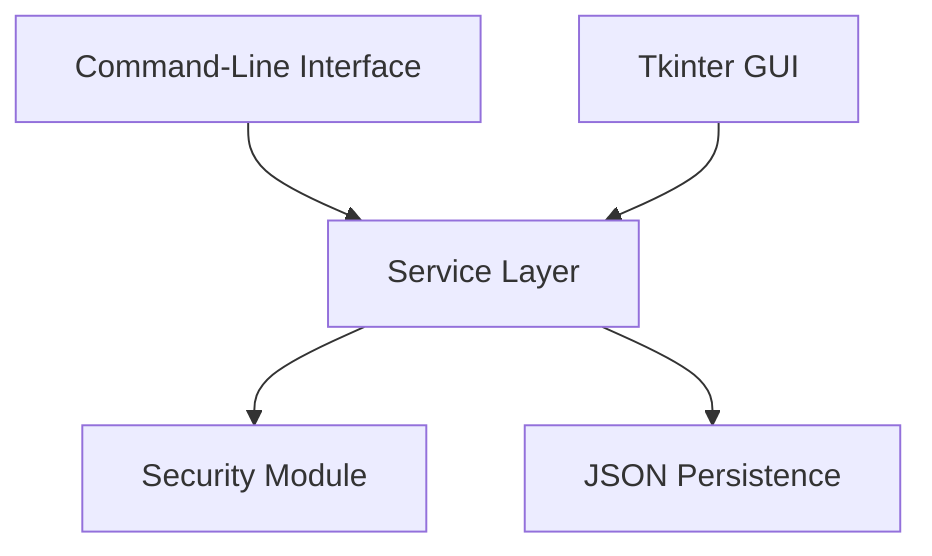

# Python E-Commerce System

A desktop e-commerce application built in Python with both command-line and Tkinter interfaces.

Originally developed as a university programming project, the application has since been revisited and refactored with a stronger focus on software structure, security, testing, maintainability, and development workflow.

## Features

- User registration and authentication
- Password hashing using `scrypt`
- Product browsing and search
- Persistent shopping carts
- Stock-aware cart validation
- Checkout with inventory validation
- Sequential order generation
- Order history
- Receipt generation
- Command-line interface
- Tkinter graphical interface
- Automated service-layer tests
- Continuous integration with GitHub Actions

## Architecture

The CLI and GUI share the same application logic rather than maintaining separate implementations of authentication, cart management, checkout, and order processing.



### Main Components

- `main.py` — command-line application entry point
- `gui.py` — Tkinter graphical interface
- `shop.py` — CLI interaction and presentation logic
- `service.py` — shared authentication, cart, checkout, order, and receipt logic
- `security.py` — password hashing and verification
- `storage.py` — JSON loading, saving, and application data initialization
- `tests/` — automated service-layer tests

## Project Structure

```text
mini-amazon-python/
├── .github/
│   └── workflows/
│       └── tests.yml
├── mini_amazon/
│   ├── __init__.py
│   ├── gui.py
│   ├── main.py
│   ├── security.py
│   ├── service.py
│   ├── shop.py
│   └── storage.py
├── tests/
│   └── test_service.py
├── .gitignore
├── README.md
└── requirements-dev.txt
```

## Running the Application

Clone the repository:

```bash
git clone https://github.com/trevorcodes24/mini-amazon-python.git
cd mini-amazon-python
```

Run the command-line interface:

```bash
python -m mini_amazon.main
```

Run the graphical interface:

```bash
python -m mini_amazon.gui
```

The application creates the required local data files automatically.

## Testing

Development dependencies are listed in `requirements-dev.txt`.

Create a virtual environment:

```bash
python -m venv .venv
```

Install the test dependencies:

```bash
python -m pip install -r requirements-dev.txt
```

Run the test suite:

```bash
python -m pytest -v
```

The current automated test suite contains **18 tests** covering areas including:

- account registration
- authentication
- duplicate-user handling
- password validation
- adding and removing cart items
- stock limits
- cart quantity merging
- successful checkout
- failed checkout state consistency
- inventory updates
- sequential order IDs
- user-specific order history
- receipt formatting

Tests are also run automatically through GitHub Actions on pushes and pull requests.

## Technical Decisions

### Shared Service Layer

The original version duplicated significant business logic between the CLI and GUI.

Authentication, cart management, checkout, stock updates, order processing, and receipt formatting were moved into a shared service layer so both interfaces follow the same application rules.

This reduces duplication and makes the core behavior easier to test and maintain.

### Password Handling

Password handling is isolated in `security.py`.

Passwords are salted and hashed using Python's `hashlib.scrypt` implementation rather than being stored directly.

### Checkout Consistency

The checkout process validates the full cart before modifying application state.

Only after validation succeeds are inventory, order history, and cart state updated.

If validation fails, the existing stock and cart remain unchanged.

### Persistence

The application currently uses JSON files for local persistence.

Generated user data, inventory state, orders, and receipts are excluded from Git so runtime data is not committed to the repository.

## Screenshots

### Graphical Interface

Screenshot coming soon.

### Command-Line Interface

Screenshot coming soon.

## Limitations

This is a learning-focused desktop application rather than a production e-commerce platform.

Current limitations include:

- JSON persistence instead of a database
- no multi-user concurrency handling
- no payment processing
- no networked backend or web API
- local-only execution
- limited product catalogue management

A production implementation would require stronger persistence, transactional consistency, validation, concurrency handling, deployment infrastructure, monitoring, and additional security controls.

## Development Background

This project began as university coursework and was later revisited as a software engineering refactor.

Rather than simply adding more features, the refactor focused on improving the structure of an already functional application.

The main goals were to:

- reduce duplicated application logic
- improve password handling
- separate persistence, security, business logic, and interfaces
- introduce automated testing
- add continuous integration
- improve repository hygiene and Git workflow
- make the codebase easier to understand and maintain
